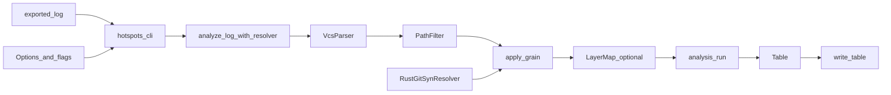
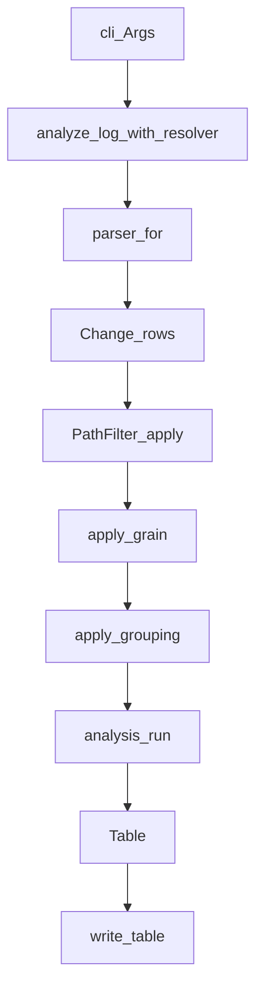
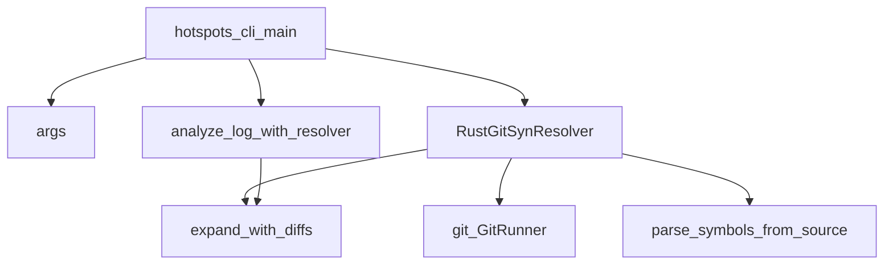

# Architecture document

hotspots mines **exported Git history logs** and prints **maintenance metrics**.
By default it ranks entities with a composite **risk** score (0–100 within the
current log) from revisions, churn, sum of coupling (SOC), and ownership
fragmentation. Metrics are **indicators**—high scores mean “investigate,” not
blame or defect probability.

Use this page to place a change in the right crate and to follow one analysis
run from log file to table.

## Purpose and scope

**Readers:** agents and human contributors who edit this workspace.

**Prerequisites:** Rust and `cargo`; basic CLI use. You do not need prior
hotspots internals.

**After you read this page, you can:**

- Name what `hotspots` owns versus what `hotspots-rs` and `hotspots-cli` own
- Trace parse → filter → grain → group → analysis → output
- Find the module for a change
- Respect the hard invariants below

### This file covers

- Workspace crate roles
- End-to-end analysis flow
- Module maps for each crate
- Hard invariants
- Verification and agent layout

### This file does not cover

- Install steps, CLI flags, and usage examples — see [README.md](../../README.md)
- Domain playbook (log formats, analyses, grain UX) — see
  [hotspots-domain](../skills/hotspots-domain/SKILL.md)
- Full local gates (check.sh, llvm-cov) — see
  [verify-gates](../skills/verify-gates/SKILL.md) and [AGENTS.md](../../AGENTS.md)
- Formatting and SOLID conventions — see
  [rust-style-guide](../skills/rust-style-guide/SKILL.md) and
  [rust-solid-design](../skills/rust-solid-design/SKILL.md)

## System context

Point `hotspots` at a pre-exported log (`-l`) and a log format (`-c git` or
`git2`). The CLI opens the log, builds [`Options`](../../crates/hotspots/src/options.rs),
optionally wires a Rust symbol resolver for function grain, runs the library
pipeline, and writes a text or JSON table to stdout.

**Ownership:**

- `hotspots-cli` owns argv, process I/O, help text, and wiring
  [`RustGitSynResolver`](../../crates/hotspots-rs/src/resolve.rs) when
  `--grain function`.
- `hotspots` owns parsing, filtering, grain orchestration, analyses, and
  table writers. The library stays std-oriented and does **not** shell out to
  `git`.
- `hotspots-rs` owns the `SymbolResolver` implementation (git CLI + `syn`).

**Runtime bar:**

- Rust toolchain **1.94.0** ([`rust-toolchain.toml`](../../rust-toolchain.toml))
- Workspace members: `hotspots`, `hotspots-cli`, `hotspots-rs`
  ([`Cargo.toml`](../../Cargo.toml))
- Workspace lint `unsafe_code` is **forbid**
- Function grain requires a Git work tree (`--repo`) whose revisions match the
  log; the `git` binary comes from `PATH`, or from `GIT_EXECUTABLE` when set

*Figure: a log file and options enter the CLI; the library parses, filters,
expands grain, groups, analyzes, and emits a table.*



## Workspace crates

| Crate | Role |
| ----- | ---- |
| [`crates/hotspots`](../../crates/hotspots) | Library: parsers, filters, grain port, metrics, text/JSON writers |
| [`crates/hotspots-rs`](../../crates/hotspots-rs) | Rust function-grain resolver (`git` CLI + `syn`) |
| [`crates/hotspots-cli`](../../crates/hotspots-cli) | Thin CLI composition root |

`hotspots-rs` depends on `hotspots` and implements
[`SymbolResolver`](../../crates/hotspots/src/symbols/types.rs). The CLI depends
on both and never embeds analysis math.

## High-level analysis flow

A `hotspots` run proceeds as follows:

1. Parse argv into CLI args and [`Options`](../../crates/hotspots/src/options.rs)
   (analysis name, thresholds, include/exclude, grain, repo, format).
2. Open the log file as a buffered reader.
3. Call
   [`analyze_log_with_resolver`](../../crates/hotspots/src/pipeline.rs):
   1. Select a [`VcsParser`](../../crates/hotspots/src/parse/mod.rs) via
      `parser_for` (`git` or `git2`).
   2. Parse the stream into [`Change`](../../crates/hotspots/src/model.rs) rows
      (cap: [`MAX_CHANGE_ROWS`](../../crates/hotspots/src/parse/mod.rs) =
      1_000_000).
   3. Apply [`PathFilter`](../../crates/hotspots/src/filter.rs) include/exclude
      prefixes.
   4. Apply grain via
      [`apply_grain`](../../crates/hotspots/src/symbols/mod.rs) (file passthrough
      or function expansion through `SymbolResolver`).
   5. Optionally remap entities with
      [`LayerMap`](../../crates/hotspots/src/group.rs) (`--group`).
   6. Run the named analysis through
      [`analysis::run`](../../crates/hotspots/src/analysis/mod.rs) into a
      [`Table`](../../crates/hotspots/src/analysis/table.rs).
4. Print function-grain drop notes to stderr when
   [`ExpandStats`](../../crates/hotspots/src/symbols/types.rs) counts are
   non-zero.
5. Write the table with
   [`write_table`](../../crates/hotspots/src/output/mod.rs) (`text` or `json`).

*Figure: the pipeline turns a log reader into a ranked table.*



### Grain

| `--grain` | Behavior |
| --------- | -------- |
| `file` (default) | Each path in the numstat log is one entity |
| `function` | Expands Rust `*.rs` changes to `path::symbol` via `--repo` and `SymbolResolver` |

Function grain stays **fail-closed**. Missing `--repo`, missing resolver, git
errors, and unparsable `.rs` abort the run. There is no silent fallback to file
grain. Non-Rust paths, paths with no line hunks, and hunks that miss all
attributed symbols are dropped and counted in `ExpandStats` (stderr notes from
the CLI). Attribution covers free `fn`, `impl` methods, and trait methods
(including nested modules)—not macros, `const`, types, statics, or other items.

Attribution uses **per-commit** symbol tables and **zero-context** hunk
overlap—not a HEAD-only map applied to numstat totals. Detail:
[hotspots-domain](../skills/hotspots-domain/SKILL.md) and [README.md](../../README.md).

### Analyses

Default analysis: **`risk`**. Other names live in
[`analysis_names()`](../../crates/hotspots/src/analysis/mod.rs) (churn,
ownership, coupling, authors, summary, and related metrics). Fallible analyses
(for example age and ownership) return `Result`; the rest return a `Table`
directly.

## `hotspots` module map

Barrel: [`crates/hotspots/src/lib.rs`](../../crates/hotspots/src/lib.rs).
Pipeline entry:
[`analyze_log` / `analyze_log_with_resolver`](../../crates/hotspots/src/pipeline.rs).

| Area | Path | Role |
| ---- | ---- | ---- |
| Orchestration | [`pipeline.rs`](../../crates/hotspots/src/pipeline.rs) | Parse → filter → grain → group → analysis |
| Parse | [`parse/`](../../crates/hotspots/src/parse/mod.rs) | `VcsParser`; `git` legacy and `git2` numstat |
| Model | [`model.rs`](../../crates/hotspots/src/model.rs) | `Change` rows |
| Filter | [`filter.rs`](../../crates/hotspots/src/filter.rs) | Include/exclude path prefixes |
| Group | [`group.rs`](../../crates/hotspots/src/group.rs) | Optional `prefix => layer` remap |
| Options | [`options.rs`](../../crates/hotspots/src/options.rs) | Analysis tunables and `Grain` |
| Symbols | [`symbols/`](../../crates/hotspots/src/symbols/mod.rs) | `SymbolResolver` port, expansion helpers |
| Analysis | [`analysis/`](../../crates/hotspots/src/analysis/mod.rs) | Named metric engines → `Table` |
| Index | [`index.rs`](../../crates/hotspots/src/index.rs) | Changeset index for coupling-style metrics |
| Output | [`output/`](../../crates/hotspots/src/output/mod.rs) | Text and JSON writers |
| Error | [`error.rs`](../../crates/hotspots/src/error.rs) | `Error` / `ErrorKind` / `Result` |

## `hotspots-rs` module map

[`RustGitSynResolver`](../../crates/hotspots-rs/src/resolve/mod.rs) implements
`SymbolResolver`. The resolver invokes `git` via argv with no shell (up to 8
concurrent jobs per expand), parses blobs with `syn`, and feeds
[`expand_with_diffs`](../../crates/hotspots/src/symbols/expand.rs).

| Area | Path | Role |
| ---- | ---- | ---- |
| Resolve | [`resolve/`](../../crates/hotspots-rs/src/resolve/mod.rs) | `RustGitSynResolver` / `SymbolResolver` |
| Git | [`git/`](../../crates/hotspots-rs/src/git/mod.rs) | `GitRunner`, work-tree checks, blob and hunk fetch |
| Diff | [`diff.rs`](../../crates/hotspots-rs/src/diff.rs) | Unified-diff hunk header parsing |
| Parse | [`parse.rs`](../../crates/hotspots-rs/src/parse.rs) | `syn` → `SymbolFact` ranges |

*Figure: CLI wires the resolver only for function grain; expansion stays behind
the library port.*



## `hotspots-cli` module map

| Area | Path | Role |
| ---- | ---- | ---- |
| Entry | [`main.rs`](../../crates/hotspots-cli/src/main.rs) | Open log, run pipeline, write stdout, exit codes |
| Args | [`args.rs`](../../crates/hotspots-cli/src/args.rs) | Flag parsing into `Options` |
| Help | [`help.rs`](../../crates/hotspots-cli/src/help.rs) | `-h/--help` text |

## Hard invariants

| Invariant | Why |
| --------- | --- |
| Log format contracts stay explicit (`git` / `git2`) | Callers control export; no silent format guessing |
| Function grain fails closed | Avoids silent wrong attribution when repo or parse fails |
| Metrics are indicators, not blame | Risk and ownership scores mean “investigate” |
| `hotspots` does not invoke `git` | Git + `syn` stay in `hotspots-rs` behind `SymbolResolver` |
| Change streams cap at `MAX_CHANGE_ROWS` (1_000_000) | Bounds memory for large exports |
| Git stdout/stderr byte caps (16 MiB / 1 MiB) | Prevents OOM from huge blobs or patches |
| Function-grain cache stores symbols, not source text | Drops blob bodies after `syn` parse |
| Function grain fans out up to 8 concurrent git jobs | Keeps long histories usable without changing attribution |
| No `#[allow]`; use `#[expect(..., reason = "...")]` | Matches workspace lints; see [rust-style-guide](../skills/rust-style-guide/SKILL.md) |
| Workspace members are `hotspots`, `hotspots-cli`, and `hotspots-rs` | Update this document if you add or rename crates |

## Exit codes

| Code | Meaning | What to do |
| ---- | ------- | ---------- |
| `0` | Success (including `--help`) | Nothing required |
| `1` | Usage, I/O, parse, git, or analysis failure | Read the `error:` line on stderr; fix flags, log, or repo |

The CLI maps every `Err` to [`ExitCode::FAILURE`](../../crates/hotspots-cli/src/main.rs).
There is no separate “findings present” exit code—analyses always emit a table
on success.

## Trust boundary

`hotspots` is a local analysis tool. The binary does not open network sockets or
execute untrusted code from the log. Residual risk is local filesystem read of
the supplied log (a near-cap change vector is still held fully in memory) and,
under function grain, read of `--repo` through time- and byte-capped `git`
subprocesses that cache parsed symbols rather than full blob text—not remote
code execution.

## Verification and agent layout

Run the workspace pipeline:

```bash
./scripts/check.sh
```

Full local `/verify` also runs llvm-cov (`--fail-under-lines 100`). CI enforces
the same coverage gate in
[`.github/workflows/coverage.yml`](../../.github/workflows/coverage.yml).
Detail: [verify-gates](../skills/verify-gates/SKILL.md), or run `/verify`.

Agent support lives under `.agents/`:

- `docs/` — this architecture file
- `skills/` — verify-gates, hotspots-domain, Rust style, SOLID
- `commands/` — `/verify`, `/design-scan`
- `rules/` — complexity budget, hotspots-domain, AI slop mitigation (opt-in)
- `hooks/` — rustfmt after edit; session context; verify on stop

See [AGENTS.md](../../AGENTS.md) for the full index.
