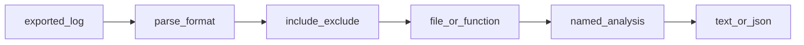

# hotspots

`hotspots` mines **exported Git history logs** and prints **maintenance metrics**.
Point the CLI at a log file and a format (`git` or `git2`). By default it ranks
entities with a composite **risk** score from **0–100 within the current log**,
built from revisions, line churn, sum of coupling (SOC), and ownership
fragmentation, and prints an **aligned terminal table**.

Metrics are **indicators**, not blame or defect probability. A high score means
“investigate,” not “this will fail.”

This README is for operators and first-time users. For crate boundaries and the
full analysis pipeline, see [ARCHITECTURE.md](.agents/docs/ARCHITECTURE.md).

## What you need

- A Rust toolchain that matches [`rust-toolchain.toml`](rust-toolchain.toml)
  (currently **1.94.0**) and `cargo`
- `git` on your `PATH` when you use `--grain function` (or set `GIT_EXECUTABLE`
  to another binary)
- A shell and a Git repository when you export a log or run function grain

## Build and run

1. Clone this repository and change to its root.
2. Build the CLI:

   ```bash
   cargo build -p hotspots-cli --release
   ```

3. Run against a log. `-l` and `-c` are required:

   ```bash
   cargo run -p hotspots-cli -- -l logfile.log -c git2 -n 1
   ```

Omitting `-a` / `--analysis` selects **`risk`**. Omitting `--format` prints a
terminal table. Use `--format json` for a JSON array of objects.

The release binary is `target/release/hotspots` after a release build. For the
full flag and analysis list, run `hotspots --help`.

## Default output

A default run (no `-a`, no `--format`) prints an aligned **text** table for the
`risk` analysis, then a footer line `N rows.`

The header uses uppercase column names. The entity column is left-aligned;
numeric columns are right-aligned. Columns are `entity`, `risk`, `revs`,
`churn`, `soc`, and `fragmentation`. The `risk` and `fragmentation` values use
two fraction digits; the other metrics are integers.

Illustrative sample (numbers are made up and only comparable within one log):

```text
  ENTITY             RISK  REVS  CHURN  SOC  FRAGMENTATION
  src/lib.rs         87.50    12    340   48           0.42
  src/cli/args.rs    61.25     7    120   21           0.18

2 rows.
```

| Column | Meaning |
| ------ | ------- |
| `entity` | File path, or `path::symbol` under `--grain function` |
| `risk` | Composite score from **0–100 within this log** (highest first) |
| `revs` | Distinct revisions that touched the entity |
| `churn` | Total added + deleted lines when the log has numstat |
| `soc` | Sum-of-coupling score for the entity |
| `fragmentation` | Ownership fragmentation indicator for the entity |

Treat every column as an investigation signal, not as blame or defect
probability. Use `--format json` when you need the same fields as a JSON array
of objects for scripting. JSON object values are always **strings** (the same
cell text as the table), including numeric metrics.

## Generate a Git log

Export history **before** you run `hotspots`. Prefer a bounded window so recent
maintenance questions are not drowned by old data.

### Preferred format (`-c git2`)

```bash
git log --all --numstat --date=short --pretty=format:'--%h--%ad--%aN' \
  --no-renames --after=YYYY-MM-DD > logfile.log
```

### Legacy format (`-c git`)

```bash
git log --pretty=format:'[%h] %aN <%ad> %s' --date=short --numstat \
  --after=YYYY-MM-DD > logfile.log
```

Angle brackets around `%ad` keep author names that contain date-like tokens
unambiguous. Older undelimited logs (`[%h] %aN %ad %s`) still parse by taking
the first `YYYY-MM-DD` token. Prefer `-c git2` when you can re-export.

Use `--no-renames` so paths stay comparable across commits. The tool rejects
rename-style numstat lines. Logs are capped at **one million** change rows.

## How a run works

From an operator’s point of view, one successful run does the following:



1. Open the log from `-l`.
2. Parse rows with the format selected by `-c`.
3. Apply `--include` / `--exclude` path filters (and optional `-g` layer map).
4. Keep file paths, or expand Rust changes to `path::symbol` when
   `--grain function`.
5. Run the named analysis (`-a`, default `risk`).
6. Write a text table or JSON to stdout.

The library does not shell out to `git`. Function grain uses a separate
resolver that calls `git` against `--repo`.

## Entity grain

| `--grain` | Behavior |
| --------- | -------- |
| `file` (default) | Each path in the numstat log is one entity |
| `function` | Expands Rust (`*.rs`) changes to `path::symbol` (free functions, `impl` methods, and trait methods, including nested modules) |

Function grain requires a Git work tree via `--repo`. Revisions in the log must
exist in that repository. Attribution uses **per-commit** symbol tables
(`git show REV:PATH`) and **zero-context** hunk overlap (`git show` /
`diff-tree -U0`). Unique `(rev, path)` keys are fetched with up to **8**
concurrent git workers. Long histories should still narrow the log with
`--after` / `--include`. It does **not** apply a HEAD-only symbol map to
numstat totals.

Deleted or renamed-away paths load symbols from the parent blob (`REV^:PATH`).
If the path is missing on both sides, the run **fails closed**. Non-Rust paths
are **dropped** (stderr reports the count). syn attributes free functions,
`impl` methods, and trait methods only — not macros, `const`, types, statics,
or other items — so edits that only touch those may miss all symbols and drop
with a stderr count. Changes with no line hunks (for example mode-only diffs)
are also dropped with a stderr count.

Failures (missing `--repo`, git errors, unparsable `.rs`, or a blob/patch over
the 16 MiB git stdout cap) **abort** the run. There is no silent fallback to
file grain. Restrict mixed-language logs with `--include`. The `git` binary
comes from `PATH`, or from `GIT_EXECUTABLE` when set.

```bash
hotspots -l logfile.log -c git2 --grain function --repo . -n 1 -r 20
```

## Analyses

Pass `-a` / `--analysis` with one of the names below. The live list is always
`hotspots --help`.

### Default: `risk`

`risk` ranks entities by a weighted score in **0–100 within the current log**.
The score mixes revision activity, line churn, sum of coupling (SOC), and
ownership fragmentation. Use it as a relative ranking for the log you exported,
not as an absolute defect probability. See [Default output](#default-output) for
a sample table and column guide.

### All analyses

| Name | Purpose |
| ---- | ------- |
| `risk` | Composite 0–100 maintenance-risk ranking (default) |
| `hotspots` | Entities ranked by revisions and total line churn when present |
| `revisions` | Entities ordered by revision count |
| `authors` | Distinct authors and revisions per entity |
| `summary` | Counts of commits, entities, change rows, and authors |
| `identity` | One output row per parsed change (debugging) |
| `abs-churn` | Added and deleted lines per calendar date |
| `author-churn` | Line churn totals by author |
| `entity-churn` | Line churn and revisions by entity |
| `coupling` | Entity pairs ranked by shared-changeset coupling degree |
| `soc` | Sum-of-coupling score per entity |
| `entity-ownership` | Added and deleted lines per entity and author |
| `main-dev` | Main developer by added lines per entity (ownership = share of additions; omits entities with no additions; use `main-dev-by-revs` for delete-only) |
| `entity-effort` | Author revisions versus total revisions per entity |
| `main-dev-by-revs` | Main developer by revision count per entity |
| `fragmentation` | Ownership fragmentation (`1 - sum(share²)`) |
| `communication` | How many entities pairs of authors both touched |
| `age` | Days since each entity’s most recent change (see `-d`) |

Several ranking analyses respect `-n` / `--min-revs` (default **5**). Coupling
analyses also use `-m`, `-i`, `-x`, and `-s` (see below). Some churn and
ownership analyses need numstat line counts and fail if those fields are
missing.

## Common options

| Flag | Meaning | Default |
| ---- | ------- | ------- |
| `-l`, `--log PATH` | VCS log file | required |
| `-c`, `--vcs git\|git2` | Log format | required |
| `-a`, `--analysis NAME` | Analysis to run | `risk` |
| `-r`, `--rows N` | Max output rows | unlimited |
| `-n`, `--min-revs N` | Min revisions per entity for ranking analyses | `5` |
| `-m`, `--min-shared-revs N` | Min shared revisions for coupling | `5` |
| `-i`, `--min-coupling N` | Min coupling degree percent | `30` |
| `-x`, `--max-coupling N` | Max coupling degree percent | `100` |
| `-s`, `--max-changeset-size N` | Max changeset size for coupling | `30` (max `200`) |
| `-d`, `--age-time-now YYYY-MM-DD` | Reference date for `age` | unset |
| `-t`, `--temporal-period day` | Merge same-day commits per author for coupling, SOC, and risk’s revision-based inputs (revs, SOC, fragmentation); churn stays total lines | off |
| `-g`, `--group FILE` | Layer map (`prefix => layer` lines; first match in file order wins — put specific prefixes first; unmatched paths keep their names) | unset |
| `--exclude PREFIX` | Drop matching paths (repeatable) | none |
| `--include PREFIX` | Keep only matching nonempty path prefixes (repeatable) | none |
| `--format text\|json` | Output format | `text` |
| `--grain file\|function` | Entity grain | `file` |
| `--repo PATH` | Git work tree (required for function grain) | unset |
| `-h`, `--help` | Show help | — |

## Examples

Default relative risk ranking as a terminal table:

```bash
cargo run -p hotspots-cli -- -l logfile.log -c git2 -n 1 -r 20
```

Same results as JSON for scripting:

```bash
cargo run -p hotspots-cli -- -l logfile.log -c git2 -n 1 -r 20 --format json
```

Function-level risk for Rust symbols:

```bash
cargo run -p hotspots-cli -- -l logfile.log -c git2 \
  --grain function --repo . -n 1 -r 20
```

Authors and ownership (also gated by `-n` / `--min-revs`):

```bash
cargo run -p hotspots-cli -- -l logfile.log -c git2 -a authors -n 5
cargo run -p hotspots-cli -- -l logfile.log -c git2 -a entity-ownership -n 5
cargo run -p hotspots-cli -- -l logfile.log -c git2 -a communication -n 5
```

Logical coupling:

```bash
cargo run -p hotspots-cli -- -l logfile.log -c git2 -a coupling
```

Drop vendor noise from a revisions ranking:

```bash
cargo run -p hotspots-cli -- -l logfile.log -c git2 -a revisions \
  --exclude vendor --exclude node_modules
```

Log-wide summary:

```bash
cargo run -p hotspots-cli -- -l logfile.log -c git2 -a summary
```

## Exit codes and failures

| Code | Meaning |
| ---- | ------- |
| `0` | Success (including `--help`) |
| `1` | Usage, I/O, parse, git, or analysis failure |

On failure the CLI prints `error: …` to stderr. Common cases:

| What failed | What to do |
| ----------- | ---------- |
| Missing or unreadable `-l` path | Check the path and permissions |
| Wrong or incomplete log format | Re-export with the matching `-c git` or `git2` recipe; avoid rename numstat lines |
| `--grain function` without `--repo` | Pass `--repo` to a work tree that contains the log’s revisions |
| Git or `syn` failure under function grain | Fix the repo, revision coverage, or Rust sources; the tool will not fall back to file grain |
| Git stdout exceeds byte cap under function grain | Split or exclude huge generated `.rs` blobs; narrow the log with `--after` / `--include` |
| Unknown `-a` name | Use a name from `hotspots --help` |
| Churn/ownership analysis on a log without numstat | Export with `--numstat` |

## Workspace

| Crate | Role |
| ----- | ---- |
| [`crates/hotspots`](crates/hotspots) | Library: parsers, filters, metrics, text/JSON writers (no `git`) |
| [`crates/hotspots-rs`](crates/hotspots-rs) | Rust function-grain resolver (`git` CLI + `syn`) |
| [`crates/hotspots-cli`](crates/hotspots-cli) | Thin CLI composition root |

Contributor layout, invariants, and verification live in
[ARCHITECTURE.md](.agents/docs/ARCHITECTURE.md) and [AGENTS.md](AGENTS.md).
An indexed project wiki is available on
[DeepWiki](https://deepwiki.com/deangrant/hotpsots).

## License

[MIT](LICENSE) © 2026 Dean Grant
